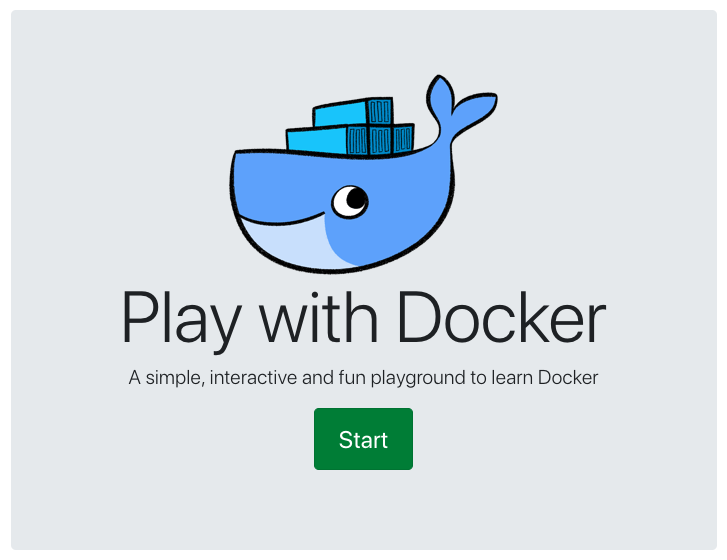
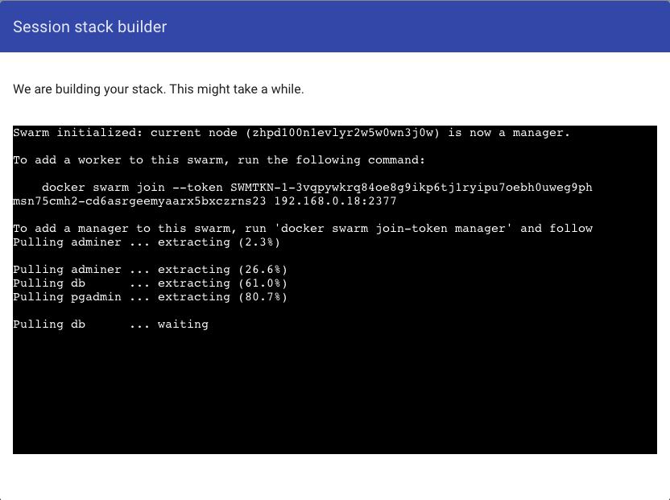
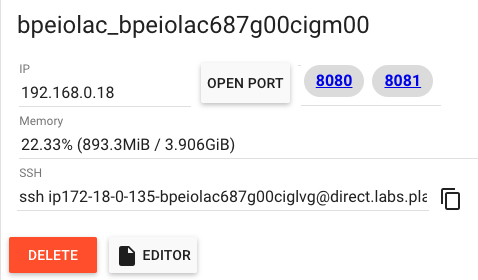
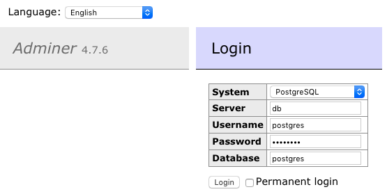
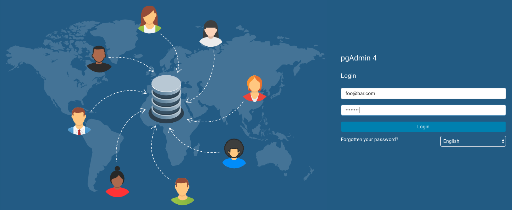
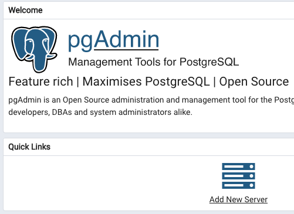
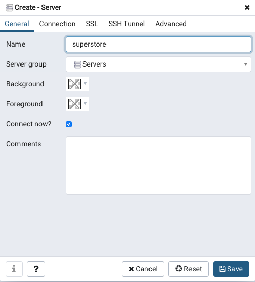
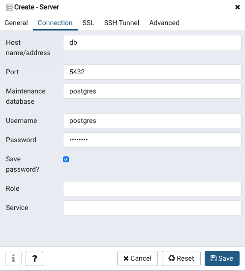

# Superstore Transformer

Script to transform the [2017/2018 Superstore Tableau
dataset](https://community.tableau.com/thread/316509) into a 5-table
pseudo-normalized star-schema database. The script serves two purposes:

1. To move from a flat OLAP table to an OLTP table for joining and SQL exercises
1. To serve as a document of transformations from the source data set should we
   need to correct errors and/or modify the resultant set in the future

The dataset originally has 51,290 rows. In its transformed state (no bootstrapping), it has the following resultant tables:

- Orders: 51,290 rows (transaction hub / fact table)
- Products: 10,292 rows
- Regions: 3,189 rows
- Returns: 4,642 rows
- Customers: 1,590 rows

This utility has the capability to bootstrap a configurable number of records with parameterized randomness. In other words, you can generate as many additional rows as you want, and the script is designed to keep equal weighting and distributions to the source dataset, effectively making the dataset more 'dense', without affecting trends, etc. Additionally, you can configure the amount of randomness you want on a per-feature basis, such as delays between order and ship date and the per-year discount trends. This can be configured within `src/config/bootstrap.json`.

A previously run, boostrapped version of this dataset can be downloaded [here](https://drive.google.com/open?id=1hAv_FA4YRgdxUML3pZbq0CaQ487ONlrg).

A batteries-included, dockerized and web-hosted solution of the resultant
  database can be used [here](http://play-with-docker.com/?stack=https://raw.githubusercontent.com/ggodreau/superstore_data/master/stack.yml).

For more information on using docker, see [configuring docker](#configuring-docker).

## Dependencies

You will need Python 3.5+, pandas, and scipy. Please be sure `which python`
returns Python 3.5+.

## Folder Structure

- `src` - transformation functions
- `src/data` - contains _input_ data files, do not modify
- `src/out` - contains generated _output_ bootstrap shards and csv files to be used in curriculum
- `src/util` - helper utilities common to root src files
- `src/config` - configuration and lookup files used during transformation

## Configuration

In `src/config` you will see the following configuration files:

- `transform.json` - this currently sets mapping of source years (i.e. 2011) to output years (i.e. 2016). These must be string values. `y1_mapping` corresponds to 2011 in the source data set and `y5_mapping` corresponds to 2016 in the source data set. Use this to shift years so you can have a data set that always looks current to students.
- `bootstrap.json` - this sets interpolation parameters during bootstrapping (i.e. number of resultant rows, tolerances for randomness, discount curves, etc.)
- `config.py` - this contains global variables for relative directory links
- `country_codes.json` - this contains a lookup of country codes and their ISO codes
- `regions.json` - this contains a list of sales reps and their territories

The most likely parameter you are looking for is in `bootstrap.json` and is the `desired_output_rows` field. This is the total number of rows in the `orders` transaction table that the bootstrapping will generate. It defaults to 1M rows and takes about 1h15m to complete in a single process on a 2018MBP.

## Running the Script

To bootstrap derive tables, clone this repository and enter the root directory. From there, run:

```
chmod +x ./run.sh && ./run.sh
```

From there, you can `tail -f out.log` to see the following:

```
02/01/2020 01:19:37 PM Transforming 51290 records in get_salesperson...
02/01/2020 01:19:37 PM Transforming 51290 records in get_return_date...
02/01/2020 01:19:37 PM Transforming 51290 records in get_return_quantity...
02/01/2020 01:19:46 PM Transforming 51290 records in get_reason_returned...
02/01/2020 01:19:52 PM Transforming 51290 records in get_discount...
02/01/2020 01:19:57 PM Transforming 51290 records in get_postal_code...
02/01/2020 01:19:57 PM Finished 'transform' in 25.5192 secs
02/01/2020 01:19:57 PM Beginning bootstrap...
02/01/2020 01:19:57 PM Interpolating data in interpolate...
02/01/2020 01:19:58 PM UID max: 5994252 min: 0 diff: 5942962 interpolate...
02/01/2020 01:20:35 PM Bootstrapping record number 60000
02/01/2020 01:21:16 PM Bootstrapping record number 70000
02/01/2020 01:22:00 PM Bootstrapping record number 80000
02/01/2020 01:22:41 PM Bootstrapping record number 90000
02/01/2020 01:23:23 PM Bootstrapping record number 100000
02/01/2020 01:24:05 PM Bootstrapping record number 110000

...

02/01/2020 02:26:03 PM Finished 'bootstrap' in 3965.3524 secs
02/01/2020 02:26:03 PM Beginning column selection...
02/01/2020 02:26:03 PM Finished 'select_columns' in 0.5843 secs
02/01/2020 02:26:03 PM Beginning normalization...
02/01/2020 02:26:03 PM Normalizing data in normalize_orders...
02/01/2020 02:26:03 PM Returned 1000000 records in normalize_orders...
02/01/2020 02:26:10 PM Normalizing data in normalize_products...
02/01/2020 02:28:17 PM Returned 10292 records in normalize_products...
02/01/2020 02:28:17 PM Normalizing data in normalize_regions...
02/01/2020 02:28:19 PM Retrieving postal code in get_postal_code...
02/01/2020 02:28:19 PM Returned 3819 records in normalize_regions...
02/01/2020 02:28:19 PM Normalizing data in normalize_returns...
02/01/2020 02:35:28 PM Returned 210380 records in normalize_returns...
02/01/2020 02:35:29 PM Normalizing data in normalize_customers...
02/01/2020 02:37:01 PM Returned 1590 records in normalize_customers...
02/01/2020 02:37:01 PM Successfully wrote files to ./src/out
02/01/2020 02:37:01 PM Finished 'normalize' in 657.7731 secs
02/01/2020 02:37:01 PM Finished 'main' in 4652.9932 secs
```

After that, your files should be written to `src/out` as a series of `.csv` files:

- `bootshard_123xx.csv` - these are shards of the bootstrap process. Should the bootstrapping terminate early for some reason, you can pick up where you left off with these files if needed.
- `bootshard_compiled.csv` - this is the raw, fully joined, non-normalized output of bootstrapping. This is the csv that then gets processed through the normalize function to create independent tables.
- Here are the bootstrapped, normalized output csv which is ready to load into a database and be used in curriculum:
  - `orders.csv`
  - `customers.csv`
  - `products.csv`
  - `regions.csv`
  - `returns.csv`

<a name="configuring-docker"></a>
## Configuring Docker

This utility has been hosted in [play with docker](https://labs.play-with-docker.com/), which is a free-to-use docker cluster that has 4 hours of persistence. This allows you to run queries against the resultant data from this script using either [adminer](https://www.adminer.org/) or [pgadmin4](https://www.pgadmin.org/download/pgadmin-4-container/).

### Loading CSVs Into Postgres Container

The PWD utility uses the [postgres official docker
image](https://hub.docker.com/_/postgres). To load our data into it, we must
create an additional layer with that data in it and then host it on docker hub.
From there, PWD retrieves our custom image (batteries included) and builds it
with adminer and pgadmin4.

The raw data from the output of the script in this repo (stored in `src/out`) must be gzipped and hosted on a public github repo. I have done this already [here](https://github.com/ggodreau/superstore_data).

Gzip the data:

```
   tar -czvf my_output_file.gz customers.csv orders.csv products.csv
   regions.csv returns.csv
```

This creates an output file `my_output_file.gz`. Host this on a public GH repo and get the raw URL to that file.

### Creating Postgres Dockerfile

Since the postgres docker image must come batteries-included with the data, we
must create a custom image and host it ourselves on docker hub. A [dockerfile
template](https://github.com/ggodreau/superstore_data/blob/master/db/dockerfile)
has been created which must be modified prior to use.

- Modify L3 (if needed) to link to your `init-db.sh` script (next step)
- Modify L9 and L10 to match the tar archive name from your previous step

### Modifying init-db.sh

The file `init-db.sh` is a file that is automatically run when the postgres
docker image boots. This allows us to perform the following actions when our
PWD cluster boots:

- Extract the tar.gz archive we made above
- Create all five tables
- Populate those tables with the extracted contents of our tar.gz archive

A template `init-db.sh` is hosted
  [here](https://github.com/ggodreau/superstore_data/blob/master/db/init-db.sh).
  Prior to using it, be sure to:

- Modify L5 to match the name of your tar.gz archive you made from the previous
step
- Modify any column headers or other information if your bootstrap script
generated data outside the existing table bounds or definitions

_Note: Current table setup for any varchar() definitions is to the .max() of
any single column to keep table memory footprint to an absolute minimum._

### Creating Postgres Docker Image

At this point, you should have:

- A `tar.gz` archive hosted on github with a public raw link
- An updated `dockerfile` to create your postgres docker image
- An updated `init-db.sh` for your postgres image startup stript

From your local machine, and in the same directory location as your `dockerfile`, run the following:

`docker build -t <your_docker_namespace>/<your_docker_repo>:<your_docker_tag>`

For example, this may be:

`docker build -t godreau/test:v1`

Your docker image should build locally.

### Test the Docker Image Locally

Run the docker image locally by running:

`docker run -it --rm <your_docker_namespace>/<your_docker_repo>:<your_docker_tag>`

For example, this may be:

`docker run -it godreau/test:v1`

You should see an output similar to the following:

```
The files belonging to this database system will be owned by user "postgres".
This user must also own the server process.

The database cluster will be initialized with locale "en_US.utf8".
The default database encoding has accordingly been set to "UTF8".
The default text search configuration will be set to "english".

Data page checksums are disabled.

fixing permissions on existing directory /var/lib/postgresql/data ... ok
creating subdirectories ... ok
selecting dynamic shared memory implementation ... posix
selecting default max_connections ... 100
selecting default shared_buffers ... 128MB
selecting default time zone ... Etc/UTC
creating configuration files ... ok
running bootstrap script ... ok
performing post-bootstrap initialization ... ok
syncing data to disk ... ok

...

/usr/local/bin/docker-entrypoint.sh: running
/docker-entrypoint-initdb.d/init-db.sh
customers.csv
orders.csv
products.csv
regions.csv
returns.csv
Creating customers table...
CREATE TABLE
Populating customers table...
COPY 1590
Creating orders table...
CREATE TABLE
Populating orders table...
COPY 1000000
Creating products table...
CREATE TABLE
Populating products table...
COPY 10292
Creating regions table...
CREATE TABLE
Populating regions table...
COPY 3819
Creating returns table...
CREATE TABLE
Populating returns table...
COPY 49725

waiting for server to shut down....2020-03-02 15:42:15.448 UTC [47] LOG:
received fast shutdown request
2020-03-02 15:42:15.450 UTC [47] LOG:  aborting any active transactions
2020-03-02 15:42:15.451 UTC [47] LOG:  background worker "logical replication
launcher" (PID 54) exited with exit code 1
2020-03-02 15:42:15.452 UTC [49] LOG:  shutting down
2020-03-02 15:42:15.663 UTC [47] LOG:  database system is shut down
 done
 server stopped

 PostgreSQL init process complete; ready for start up.

 2020-03-02 15:42:15.772 UTC [1] LOG:  starting PostgreSQL 12.2 (Debian
 12.2-2.pgdg100+1) on x86_64-pc-linux-gnu, compiled by gcc (Debian 8.3.0-6)
 8.3.0, 64-bit
 2020-03-02 15:42:15.772 UTC [1] LOG:  listening on IPv4 address "0.0.0.0",
 port 5432
 2020-03-02 15:42:15.772 UTC [1] LOG:  listening on IPv6 address "::", port
 5432
 2020-03-02 15:42:15.776 UTC [1] LOG:  listening on Unix socket
 "/var/run/postgresql/.s.PGSQL.5432"
 2020-03-02 15:42:15.793 UTC [149] LOG:  database system was shut down at
 2020-03-02 15:42:15 UTC
 2020-03-02 15:42:15.798 UTC [1] LOG:  database system is ready to accept
 connections
```

The last line should say that the database system is ready to accept connections. Note that you will have a `server stopped` message during the startup, this is normal.

Stop the running container with `CTRL+C`.

### Push to Docker Hub

Push your built image to docker hub:

`docker push <your_docker_namespace>/<your_docker_repo>:<your_docker_tag>`

For example:

`docker push godreau/test:v1`

### Modify Stack Configuration Script

There is one final script that PWD uses, `stack.yaml`. This file is used to tell PWD which docker images to pull in, as well as any port configuration.

A template has been created [here](https://github.com/ggodreau/superstore_data/blob/master/stack.yml).

- Modify the template L7 to point to your public docker image and tag.
- (Optional) - Modify any environment variables or configuration as needed

Host the above template in a public repository.

### Calling PWD With Your Stack

To invoke the PWD cluster, you must append the URL to your `stack.yaml` from
the previous step to the following URL:

```
http://play-with-docker.com/?stack=
```

Example:

```
http://play-with-docker.com/?stack=https://raw.githubusercontent.com/ggodreau/superstore_data/master/stack.yml
```

Now, calling this URL invokes your `stack.yaml` and builds your cluster.

## Using the PWD Cluster

After calling the `play-with-docker` link above, you will be need to create a docker hub account (if you don't have one already).

After you get an account, you'll be greeted with the following screen:

<p align="center">

</p>

From there, click on start and wait for your cluster to build:

<p align="center">

</p>

From there, you can click on either `8080` to user the [adminer](#adminer) interface, or `8081` to use the [pgadmin4](#pgadmin4) interface.

<p align="center">

</p>

<a name="adminer"></a>
### Adminer

The adminer login will pop up (it may take ~30s or so):

<p align="center">

</p>

The credentials to connect to the db are:

- System: `PostgreSQL`
- Server: `db`
- Username: `postgres`
- Password: `password`
- Database: `postgres`

From there, you can click on `SQL Command` in the left pane and run queries.

<a name="pgadmin4"></a>
### PgAdmin4

The pgadmin4 login usually takes 1-3m to boot after the cluster finishes booting. After that period, you can log in:

<p align="center">

</p>

The credentials for the login screen are:

- Username: `foo@bar.com`
- Password: `password`

From there, click on 'Add New Server' from the quick links section:

<p align="center">

</p>

Under the general tab, set 'superstore' as the database name:

<p align="center">

</p>

Under the connections tab, use the following credentials:

- Host name / address: `db`
- Port: `5432`
- Maintenance database: `postgres`
- Username: `postgres`
- Password: `password`

<p align="center">

</p>

Your data will be Servers -> superstore -> databases -> postgres -> schemas -> public -> tables
